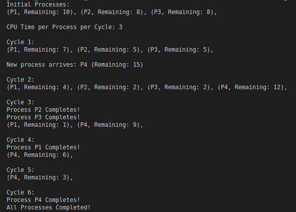
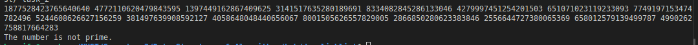

# CPU Process Scheduling Algorithm

## Approach
The project implements a CPU process scheduling algorithm using a **Circular Linked List**. Each process is represented as a node in the list, allowing for efficient management of processes in a cyclic manner. The algorithm assigns CPU time in cycles while handling new process arrivals dynamically. This ensures that processes get fair CPU time and improves overall system responsiveness.

## Assumptions
- Each process has a defined burst time and arrival time.
- The time quantum for the CPU cycles is fixed and can be adjusted based on requirements.
- The input data is validated to ensure that all required fields are present for each process.

## GitHub Link
[GitHub Repository](https://github.com/SparkDrago05/dsa_linklist)

## Challenges Faced
- Implementing the circular linked list structure required careful management of pointers to avoid memory leaks and segmentation faults.
- Dynamically handling new process arrivals while maintaining the scheduling order posed a significant challenge.
- Testing with various input scenarios to ensure the algorithm's robustness and efficiency required thorough validation.
- Specially handle case when there is only one process left during the cycle.

## Screenshot of Output
Below is the screenshot of the output:
   

## Conclusion
This project successfully demonstrates the implementation of a CPU process scheduling algorithm using a circular linked list, effectively managing process execution while overcoming various challenges. 

---

# Prime Number Checker

## Approach
This project implements an algorithm to determine if a 1024-bit number is prime by using a linked list to store the number in manageable chunks using **Miller-Rabin** Probabilistic test. The algorithm efficiently checks for primality through trial division and optimizes the search by eliminating even numbers and handling large numbers through chunked storage.

## Assumptions
- The input number is a valid 1024-bit number represented as a string or array of digits.
- The algorithm does not handle negative numbers or non-numeric inputs.
- Chunk size for linked list storage is predetermined for efficiency.

## GitHub Link
[GitHub Repository](https://github.com/SparkDrago05/dsa_linklist)

## Challenges Faced
- Managing the storage of large numbers in a linked list format posed significant challenges, especially ensuring that the algorithm can process the entire number correctly.
- Implementing efficient primality testing for large numbers required careful optimization to minimize unnecessary calculations.
- Debugging issues related to linked list pointer manipulation and number representation proved to be time-consuming.

## Screenshot of Output
Below is the screenshot of the output:
   

## Conclusion
This project successfully demonstrates the implementation of a prime number checking algorithm **(Miller-Rabin Test)** using a linked list to manage large numbers efficiently, addressing various challenges along the way.

---

